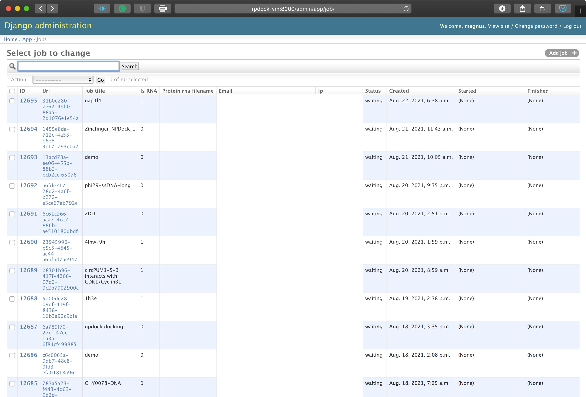

webserver-engine
===================================

This project is a part of my [rna-tools](https://github.com/mmagnus/rna-tools/tree/master/rna_tools/tools/webserver-engine), so please cite this paper if you find this repository useful for you:

	Magnus M, Antczak M, Zok T, Wiedemann J, Lukasiak P, Cao Y, Bujnicki JM, 
	Westhof E, Szachniuk M, Miao Z. 
	RNA-Puzzles toolkit: a computational resource of RNA 3D structure benchmark datasets, 
	structure manipulation, and evaluation tools. 
	Nucleic Acids Research. 2019 10.1093/nar/gkz1108 
	
<https://academic.oup.com/nar/advance-article/doi/10.1093/nar/gkz1108/5651330>

The light-weight, complete webserver engine used by me for servers: NPDock (RNA/DNA-protein docking method, http://genesilico.pl/NPDock/), SimRNAweb (RNA 3D structure prediction method, http://iimcb.genesilico.pl/SimRNAweb/), mqapRNA (RNA 3D quality control, http://iimcb.genesilico.pl/mqapRNA/), RNAMasonry (building RNA models from recurrent 3D motifs, http://genesilico.pl/rnamasonry).

The engine handels all commont tasks for a simple webserver:

- accept a job and saves the data into an internal database,
- controals a Python deamon for job execution on the server,
- handle progress of a job,
- present the results,
- sends mail for a job at the start and end,
- sends reports to admins on server usage,
- with full-fledged Django admin to control jobs.

The server is easily customizable for new applications. The server by design and very light-weight and can be easily encapsulated into a single, simple virtual environment.

Let me know if you need any help to set it up for yourself (--@mmagnus).

Table of Contents
=================

* [Components](#components)
* [The details](#the-details)
  * [\.sh vs \.py](#sh-vs-py)
  * [cleanup\.py](#cleanuppy)
  * [app\_checker\.py](#app_checkerpy)
* [Configuration](#configuration)
  * [For the daemon\.py](#for-the-daemonpy)
  * [For the web server](#for-the-web-server)
* [Run](#run)
* [Tips](#tips)
  * [Django server for debugging](#django-server-for-debugging)
* [Install](#install)

Created by [gh-md-toc](https://github.com/ekalinin/github-markdown-toc.go)

# Components

Usually the server has 2 components, the web server itself and then main tool the server was build for, e.g., for NPDock this is `npdock_web` and npdock app with some extra program for Monte Carlo refinement, `npdock_mc`:

Server:
- npdock server `npdock_web`

The main program:
- npdock (run_gramm) `npdock`
- Refinement of RNA/DNA-protein complexes, `npdock_mc`

# The details

There is also a Django admin panel where you can view and control all the jobs. You can access this panel under `http://<ip/url>:8000/admin/login/?next=/admin/`, e.g., `http://rpdock-vm:8000/admin/login/?next=/admin/` (this panel can be accessed only within a local network or using VPN, this protects this panel from access outside the secure network).

There is a web folder in `/home/rpdock/web`. The web folder contains a Django application with an SQLite database and `daemon.py`.

The Django application is started automatically from cron:

	@reboot /home/rpdock/web/startweb-screen.sh

`startweb-screen.sh` contains:

	screen -mdS 'web' /home/rpdock/web/startweb.sh

This should go up after the restart of a virtual machine.

So, this is the server. Then, how to get running a new job. A new job is created as an entry to the Django database via the submit form of the Django application. Every minute, from cron, there is a daemon script executed that checks if there is a new entry in the Django database:

	* * * * * /home/rpdock/web/daemon.sh

If there is, then the main program for which the whole web application has been created in the first place is executed. daemon.sh checks for free space on the drive, and also checks for how many others jobs are running; in this way, you can hold running new jobs if more than 4 jobs are running currently at a virtual machine (= having a simple queue).

## .sh vs .py

You can see here that for all Python scripts, there is a small shell wrapper (e.g., `daemon.sh` for `daemon.py`) that contains extra code to make sure that the correct Python Environment is loaded for the Python code.

## cleanup.py
There is implemented cleaning procedure, this really depends on your setup. Again, this can be run from crontab, for example every 1h:

	0 * * * * /home/rpdock/web/cleanup.sh --go #&> /dev/null

## app_checker.py
 
There is also a script that sends mail with a list of jobs to your mailbox, so you can check if everything is fine. And once again, this can be executed from crontab, in my case I like to get these emails at 5pm.

	00 17 * * * /home/rpdock/web/app_checker.py

So the full crontab setup can look like this:

	➜  web git:(master) ✗ crontab -l
	SHELL=/bin/bash
	#MAILTO="magnus@genesilico.pl"
	* * * * * /home/rpdock/web/daemon.sh
	00 17 * * * /home/rpdock/web/app_checker.py
	0 * * * * /home/rpdock/web/cleanup.sh --go
	@reboot /home/rpdock/web/startweb-screen.sh
    
# Configuration
## For the `daemon.py`

	MAX_RUNNING = 4  # number of jobs max
	DISK_SPACE_LIMIT = 20  # each 4 of jobs 5gb = 20g free must be
	keep data for 4d

## For the web server

Go to web.settings for full configuration:

    SERVER_NAME = 'RNAMasonry'
    ADMIN_JOBS_URL = 'http://0.0.0.0:8667/admin/app/job/'
    DISK_TO_TRACK = '/dev/mapper/rnamasonry--vm--vg-root'
    import os; 
    PATH = os.path.abspath(os.path.join(os.path.dirname(__file__), os.path.pardir)) 
    JOBS_PATH = PATH + os.sep + 'media' + os.sep + 'jobs'
    URL_JOBS = "http://iimcb.genesilico.pl/rnamsonry/jobs/"  # required /
    URL = "http://iimcb.genesilico.pl/rnamasonry" # / is not needed"
    DEBUG = True
    TEMPLATE_DEBUG = False
    PATH_TO_RM = ''
    POWER_USERS = ['magnus@genesilico.pl']
    SEND_EACH_MAIL_TO_ADMIN = False
    SERVER_REPLY_MAIL = 'rnamasonry@genesilico.pl'
    ADMIN_MAIL = 'magnus@genesilico.pl' # used for sendmail
    ADMINS = (
         ('magnus', 'mag_dexxxxxxxo2.pl'),
    )
# Run
-------------------------------------------------------------------------------
    
    (py27) [mx] rnamasonry$ git:(master) ✗ source ../bin/activate
    
    (rnamasonry_env) (py27) [mx] rnamasonry$ git:(master) ✗ python manage.py runserver --settings web.settings 0.0.0.0:8667
    Performing system checks...

    System check identified some issues:

    WARNINGS:
    app.Job.interpret_occupancy: (fields.W122) 'max_length' is ignored when used with IntegerField
        HINT: Remove 'max_length' from field
    app.Job.nsteps: (fields.W122) 'max_length' is ignored when used with IntegerField
        HINT: Remove 'max_length' from field
    app.Job.seq_len: (fields.W122) 'max_length' is ignored when used with IntegerField
        HINT: Remove 'max_length' from field
    app.Job.status: (fields.W122) 'max_length' is ignored when used with IntegerField
        HINT: Remove 'max_length' from field

    System check identified 4 issues (0 silenced).
    April 16, 2020 - 18:20:58
    Django version 1.8, using settings 'web.settings'
    Starting development server at http://0.0.0.0:8667/
    Quit the server with CONTROL-C.

# Tips
## Django server for debugging

You can use also internal version for debugging under http://rpdock-vm:8000/ (this panel can be accessed only within a local network or using VPN, this protects this panel from access outside the secure network).

# Install

    (py27) [mx] src$ pip install virtualenv

    (py27) [mx] src$ python -m virtualenv rnamasonry_env
    created virtual environment CPython2.7.16.final.0-64 in 385ms
      creator CPython2Posix(dest=/Users/magnus/work/src/rnamasonry_env, clear=False, global=False)
      seeder FromAppData(download=False, pip=latest, setuptools=latest, wheel=latest, via=copy, app_data_dir=/Users/magnus/Library/Application Support/virtualenv/seed-app-data/v1.0.1)
      activators PythonActivator,CShellActivator,FishActivator,PowerShellActivator,BashActivator

    (rnamasonry_env) (py27) [mx] rnamasonry$ git:(master) pip install -r install.txt
    DEPRECATION: Python 2.7 reached the end of its life on January 1st, 2020. Please upgrade your Python as Python 2.7 is no longer maintained. A future version of pip will drop support for Python 2.7. More details about Python 2 support in pip, can be found at https://pip.pypa.io/en/latest/development/release-process/#python-2-support
    Requirement already satisfied: Django==1.8 in /Users/magnus/work/src/rnamasonry_env/lib/python2.7/site-packages (from -r install.txt (line 1)) (1.8)
    Requirement already satisfied: argparse==1.2.1 in /Users/magnus/work/src/rnamasonry_env/lib/python2.7/site-packages (from -r install.txt (line 2)) (1.2.1)
    Requirement already satisfied: decorator==4.0.6 in /Users/magnus/work/src/rnamasonry_env/lib/python2.7/site-packages (from -r install.txt (line 4)) (4.0.6)
    Requirement already satisfied: django-extensions==1.6.1 in /Users/magnus/work/src/rnamasonry_env/lib/python2.7/site-packages (from -r install.txt (line 5)) (1.6.1)
    Requirement already satisfied: django-ipware==1.1.6 in /Users/magnus/work/src/rnamasonry_env/lib/python2.7/site-packages (from -r install.txt (line 6)) (1.1.6)
    Requirement already satisfied: ipdb==0.8.1 in /Users/magnus/work/src/rnamasonry_env/lib/python2.7/site-packages (from -r install.txt (line 7)) (0.8.1)
    Requirement already satisfied: ipython==4.0.1 in /Users/magnus/work/src/rnamasonry_env/lib/python2.7/site-packages (from -r install.txt (line 8)) (4.0.1)
    Requirement already satisfied: ipython-genutils==0.1.0 in /Users/magnus/work/src/rnamasonry_env/lib/python2.7/site-packages (from -r install.txt (line 9)) (0.1.0)
    Requirement already satisfied: numpy==1.10.2 in /Users/magnus/work/src/rnamasonry_env/lib/python2.7/site-packages (from -r install.txt (line 10)) (1.10.2)
    Requirement already satisfied: path.py==8.1.2 in /Users/magnus/work/src/rnamasonry_env/lib/python2.7/site-packages (from -r install.txt (line 11)) (8.1.2)
    Requirement already satisfied: pexpect==4.0.1 in /Users/magnus/work/src/rnamasonry_env/lib/python2.7/site-packages (from -r install.txt (line 12)) (4.0.1)
    Requirement already satisfied: pickleshare==0.5 in /Users/magnus/work/src/rnamasonry_env/lib/python2.7/site-packages (from -r install.txt (line 13)) (0.5)
    Requirement already satisfied: ptyprocess==0.5 in /Users/magnus/work/src/rnamasonry_env/lib/python2.7/site-packages (from -r install.txt (line 14)) (0.5)
    Requirement already satisfied: simplegeneric==0.8.1 in /Users/magnus/work/src/rnamasonry_env/lib/python2.7/site-packages (from -r install.txt (line 15)) (0.8.1)
    Requirement already satisfied: six==1.10.0 in /Users/magnus/work/src/rnamasonry_env/lib/python2.7/site-packages (from -r install.txt (line 16)) (1.10.0)
    Requirement already satisfied: traitlets==4.0.0 in /Users/magnus/work/src/rnamasonry_env/lib/python2.7/site-packages (from -r install.txt (line 17)) (4.0.0)
    Requirement already satisfied: wsgiref==0.1.2 in /Users/magnus/miniconda2/envs/py27/lib/python2.7 (from -r install.txt (line 18)) (0.1.2)
    Requirement already satisfied: appnope; sys_platform == "darwin" in /Users/magnus/work/src/rnamasonry_env/lib/python2.7/site-packages (from ipython==4.0.1->-r install.txt (line 8)) (0.1.0)
    Requirement already satisfied: gnureadline; sys_platform == "darwin" and platform_python_implementation == "CPython" in /Users/magnus/work/src/rnamasonry_env/lib/python2.7/site-packages (from ipython==4.0.1->-r install.txt (line 8)) (8.0.0)
	
## Create db based on models.py
	
	$ python manage.py migrate
	python manage.py runserver
	System check identified some issues:
	
	WARNINGS:
	app.Job.interpret_occupancy: (fields.W122) 'max_length' is ignored when used with IntegerField
		HINT: Remove 'max_length' from field
	app.Job.nsteps: (fields.W122) 'max_length' is ignored when used with IntegerField
		HINT: Remove 'max_length' from field
	app.Job.saxs_format: (fields.W122) 'max_length' is ignored when used with IntegerField
		HINT: Remove 'max_length' from field
	app.Job.seq_len: (fields.W122) 'max_length' is ignored when used with IntegerField
		HINT: Remove 'max_length' from field
	app.Job.status: (fields.W122) 'max_length' is ignored when used with IntegerField
		HINT: Remove 'max_length' from field
	Operations to perform:
	  Synchronize unmigrated apps: staticfiles, app, messages
	  Apply all migrations: contenttypes, auth, admin, sites, sessions
	Synchronizing apps without migrations:
	  Creating tables...
	    Creating table app_setting
	    Creating table app_job
	    Running deferred SQL...
	  Installing custom SQL...
	Running migrations:
	  Rendering model states... DONE
	  Applying contenttypes.0001_initial... OK
	  Applying auth.0001_initial... OK
	  Applying admin.0001_initial... OK
	  Applying contenttypes.0002_remove_content_type_name... OK
	  Applying auth.0002_alter_permission_name_max_length... OK
	  Applying auth.0003_alter_user_email_max_length... OK
	  Applying auth.0004_alter_user_username_opts... OK
	  Applying auth.0005_alter_user_last_login_null... OK
	  Applying auth.0006_require_contenttypes_0002... OK
	  Applying sessions.0001_initial... OK
	  Applying sites.0001_initial... OK
	Performing system checks...

## Create superuser account

	
	$ python manage.py createsuperuser

	Username (leave blank to use 'magnus'): admin
	Email address: 
	Password:
	Password (again):
	Superuser created successfully.

 ## Run runme_dev.sh

 and see if you can reach http://localhost:8999/admin/
